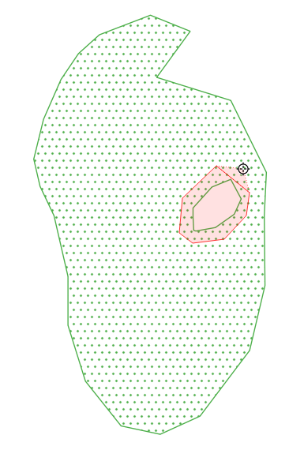
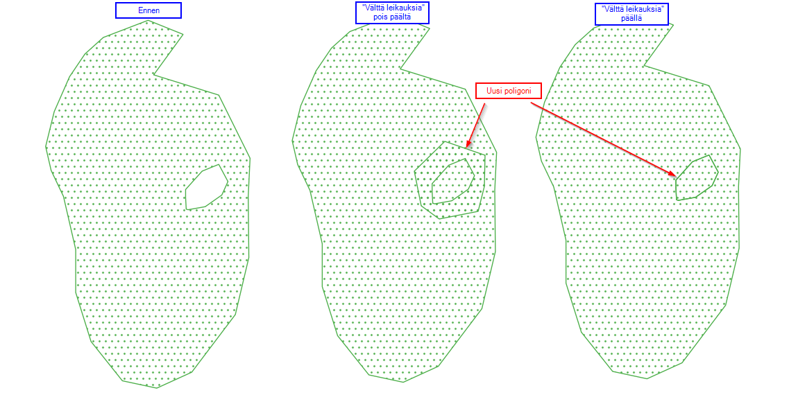
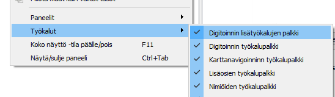
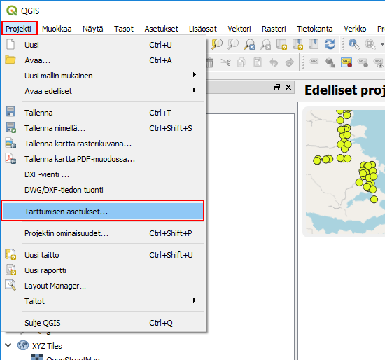
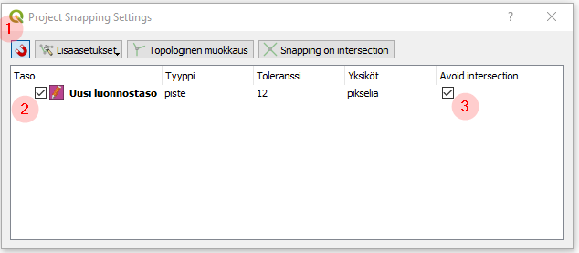
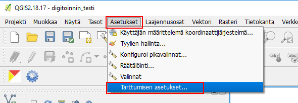
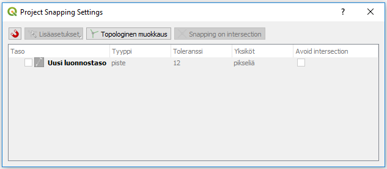
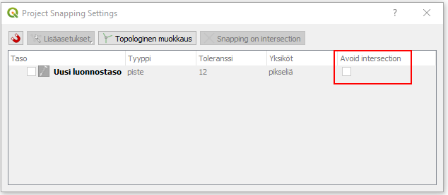
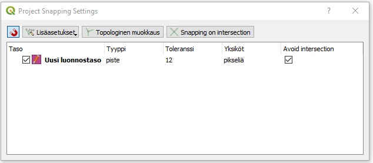
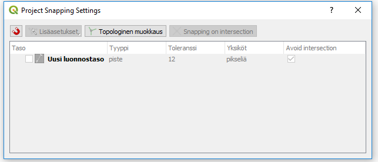

# Poligonin "tyhjä" piiri uusiksi poligoniksi
(Käytössä dokumentin luonnissa QGIS 2.18.17 ja QGIS 3.0.2, Windows)

Kun kyseessä on olemassa oleva poligoini jonka sisällä on "tyhjä" sisäpiiri helpoiten voidaan luoda uusi poligoni piiirin paikalle näin:

- kyseessä olevan poligonin tason tartumisen asetukset ovat seuraavasti (katso alempi tarkemmin ohjeita ja huomioita):
  - "Välttä leikkauksia" on päällä
  - "Topologinen muokkaus" on päällä
- piirretään uusi poligoni piirtämällä suurpiirteinen poligoni joka kattaa koko poligonin sisäpiiriä

<table style="width:20%">
<tr>
    <td>  </td>
</tr>
</table>

Tarttumisen asetukset hoittavat se, että uusi poligoni leikataan sisäpiirin muotoon.

<table style="width:65%">
<tr>
    <td>  </td>
</tr>
</table>

Käytä läpinäkyvä tyyli niin näkee missä poligonin reunat ovat.

## Tarvittavat asetukset
### Digitoinnin lisätyökaluen palkki
Jos tarvetta digitoida uusia poligonin sisäpiirejä.

<table style="width:50%">
<tr>
    <td> QGIS 3.0 </td>
</tr>
<tr>
    <td>  </td>
</tr>
</table>

 
### Tarttumisen asetukset

QGIS 3.0:ssä **Projeckti**-väliköstä

<table style="width:50%">
<tr>
    <td> QGIS 3.0 </td>
</tr>
<tr>
    <td>  </td>
</tr>
</table>

 

### "Avoid intersection" ("Vältä leikkauksia")

Näin aktivoidaan "Avoid intersection" ("Vältä leikkauksia") on päällä:

<table style="width:55%">
<tr>
    <td> QGIS 3.0 </td>
</tr>
<tr>
    <td>  </td>
</tr>
</table>

  

## Huomiot tarttumisen asetuksista QGIS:ssä

### Tarttumisen asetukset 2.8 vs 3.0 versiot
Samanlaiset asetukset 2.8 ja 3.0 versioissa vaan uudemmassa versiossa Tarttumisen asetukset ovat siirtynyt projektin kohtaiseksi ja sen mukaan **Projeckti**-välikköön.

<table style="width:80%">
<tr>
    <td> QGIS 2.8 </td>
    <td> QGIS 3.0 </td>
</tr>
<tr>
    <td>  </td>
    <td>  </td>
</tr>
</table>

### "Tarttumisen asetukset" -ikkuna QGIS 3.0
Tosin QGIS 3.0:ssä Tarttumisen asetukset valinnat ovat hämäävästi esitetty ainakin kun verrataan 2.8 versioon. Vanha käyttäjän täytyy tottua. Myös ikkunan otsikko (Project Snapping Settings) ja useita ikkunan osioita eivät ole käännetty.

  <td>  </td>

### "Vältä leikkauksia" asetus
QGIS 3.0:ssä "Avoid intersection" ("Vältä leikkauksia") asetus voi muuttaa vaan jos taso on valittu "Tarttumisen asetukset" ikkunassa mutta valinta on voimassa vaikka taso ei olisi siinä ikkunassa valittuna. Tämä korjaantuu varmasti tulevissa versioidn päivityksissä (vrt QGIS 2.8, "Vältä leikkauksia" asetus voi muuttaa vaikka taso ei olisi valittuna kyseessä "Tarttumisen asetukset" ikkunassa).

Tässä kuvassa "Avoid intersection" ("Vältä leikkauksia") on pois päältä:

<table style="width:50%">
<tr>
    <td> QGIS 3.0 </td>
</tr>
<tr>
    <td>  </td>
</tr>
</table>

Näissä molemmissa tapauksissa on päällä:
<table style="width:90%">
<tr>
    <td>  </td>
    <td>  </td>
</tr>
</table>
