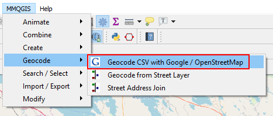
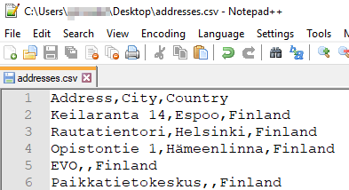
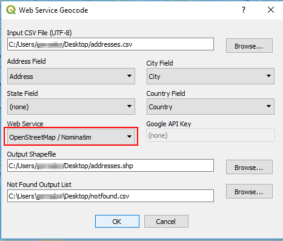
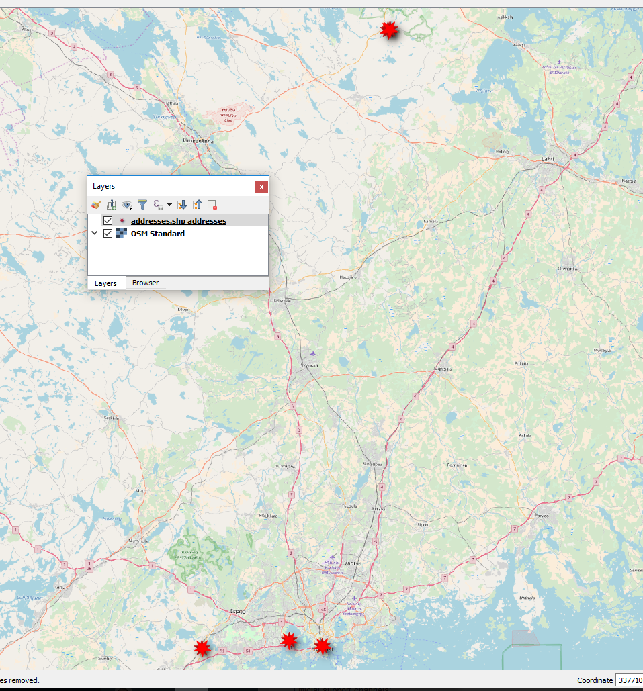
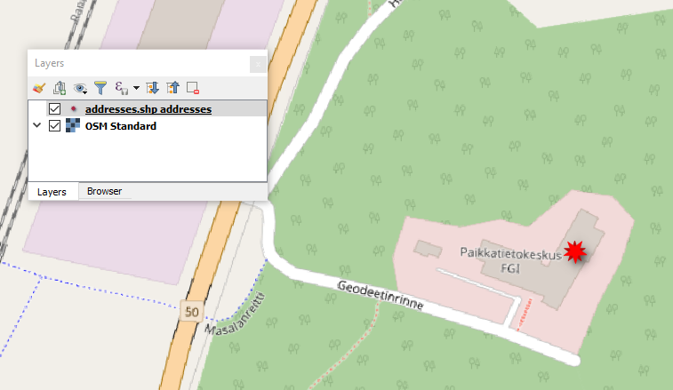

# Using QGIS 3 for geocoding
Some quick tests geocoding Finnish addresses in QGIS 3.

## Using the MMQGIS plugin
Load and activate the MMQGIS first. Then open it from the MMQGIS menu in QGIS:



The plugin requires a CSV file with the addresses in a specific format. For details, see the plugin documentation in the [plugin page](http://michaelminn.com/linux/mmqgis/) (or guess the format from the dialog window). An example CSV file:



Select the addresses file and run the geocoding:



A new shapefile is created with the geocoded address (note that unrecognize addresses are saved to the text file you
specified in the dialog box). This is the result when using the OpenStreetmap/Nominatim geocoding service. Note that
you can use Google too but you will need to get an API key (see mmqgis plugin's pages for more info). Our result shapefile looks like this:



Note that one of the addresses contained only the name of a well known place and the country:
````
  Paikkatietokeskus,,Finland
````
... yet the geocoding worked as expected:



## Other test to be done
* [MMQGIS](http://michaelminn.com/linux/mmqgis/) using Google API
* Gispo's [Digitransint routing](https://github.com/GispoCoding/QGISDigitransitGeocoding) (Finland only)
